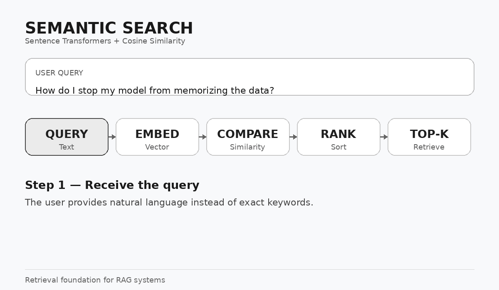

Semantic Search using Sentence Transformers

  

  A practical implementation of semantic retrieval using text embeddings and cosine similarity.

1. Overview

This project implements a basic Semantic Search system using
Sentence Transformers and cosine similarity.

The system retrieves the most relevant documents from a knowledge base
according to their semantic meaning, rather than relying exclusively
on exact keyword matching.

This implementation demonstrates the core retrieval process that is
commonly used as part of Retrieval-Augmented Generation (RAG) systems.

2. Objective

The project is designed to demonstrate the following concepts:

Converting text into vector embeddings

Representing documents in a common vector space

Encoding a user query

Measuring semantic similarity

Ranking documents by similarity

Retrieving the Top-K relevant documents

3. Technologies

Technology

Purpose

Python

Core implementation

Sentence Transformers

Text embedding generation

all-MiniLM-L6-v2

Pre-trained embedding model

NumPy

Vector operations

Cosine Similarity

Similarity measurement

Jupyter Notebook

Development and experimentation

4. How the System Works

                     USER QUERY
                          |
                          v
               Sentence Transformer
                          |
                          v
                   Query Embedding
                          |
                          v
              +-----------------------+
              |  Cosine Similarity    |
              |                       |
              | Query vs Every Doc    |
              +-----------+-----------+
                          |
                          v
                  Similarity Scores
                          |
                          v
                    Sort Results
                          |
                          v
                       Top-K
                          |
                          v
                Relevant Documents

Process

A knowledge base is created containing machine-learning concepts.

Each document is converted into an embedding.

The user's query is converted into an embedding.

The query embedding is compared with every document embedding.

Cosine similarity produces a score for each document.

Documents are sorted by their similarity scores.

The highest-ranked Top-K documents are returned.

5. Knowledge Base

The current knowledge base contains information about:

Linear Regression

Decision Trees

Random Forests

Overfitting

Cross-Validation

Feature Scaling

Logistic Regression

K-Means Clustering

Gradient Descent

Regularization

Confusion Matrix

Precision

Recall

ROC Curve

SMOTE

6. Embeddings

The project uses:

from sentence_transformers import SentenceTransformer

model = SentenceTransformer(
    "sentence-transformers/all-MiniLM-L6-v2"
)

The knowledge-base documents are encoded using:

kb_embeddings = model.encode(knowledge_base)

Conceptually:

Text
  |
  v
Sentence Transformer
  |
  v
Numerical Embedding

For example:

"Overfitting occurs when a model memorizes training data."
                         |
                         v
             [0.12, -0.43, 0.87, ...]

The embedding represents the sentence as a vector in a numerical
semantic space.

7. Cosine Similarity

The project compares the query embedding with each document embedding
using cosine similarity:

def cosine_similarity(vec1, vec2):

    vec1, vec2 = np.array(vec1), np.array(vec2)

    return float(np.dot(vec1, vec2)) / (
        np.linalg.norm(vec1) * np.linalg.norm(vec2)
    )

Conceptually:

Query Vector
      |
      |-------------------+
      |                   |
      v                   v
Document Vector 1   Document Vector 2
      |                   |
      +---------+---------+
                |
                v
       Cosine Similarity
                |
                v
         Similarity Score

A higher score indicates greater similarity in the embedding space.
The score is used primarily to rank the retrieved documents.

8. Ranking and Top-K Retrieval

Each comparison produces:

(similarity_score, document_index)

For example:

Similarity     Index
--------------------
0.91           3
0.84           9
0.78           4
0.65           1
0.52           7

The results are sorted:

result.sort(reverse=True)

If:

top_k = 3

the system returns:

result[:top_k]

This gives the three highest-ranked documents.

9. Practical Example

Query

How do I stop my model from memorizing the data?

The knowledge base does not contain this exact sentence.

However, it contains:

Overfitting happens when a model memorizes the training data
including noise, performing great on training but poorly on new data.

Semantic search can identify the relationship between the query and
this document even though the wording is different.

A possible retrieval result is:

Rank

Document

Relationship

1

Overfitting

Directly related

2

Regularization

Related

3

Cross-Validation

Related

The exact similarity values depend on the embedding model and input.

10. Semantic Search vs Keyword Search

Characteristic

Keyword Search

Semantic Search

Primary basis

Matching words

Meaning represented by embeddings

Exact wording

More important

Less important

Embeddings

Not required

Required

Paraphrased queries

Can be difficult

Better suited

Vector similarity

No

Yes

RAG retrieval

Can be used

Common approach

Example

Query:

Why does my model remember the training examples too well?

Relevant document:

Overfitting occurs when a model memorizes training data.

The wording is different, but the underlying concept is similar.

11. Core Implementation

def semantic_Search(query, top_k=3):

    query_emb = model.encode(query)

    result = []

    for i, doc_emb in enumerate(kb_embeddings):

        sim = cosine_similarity(query_emb, doc_emb)

        result.append((sim, i))

    result.sort(reverse=True)

    for rank, (sim, idx) in enumerate(result[:top_k], 1):

        print(f"\n#{rank} [similarity: {sim:.4f}]")
        print(knowledge_base[idx])

    return result[:top_k]

Example:

semantic_Search(
    "how do I stop my model from memorizing the data"
)

12. Project Architecture

+----------------------+
|    Knowledge Base    |
+----------+-----------+
           |
           v
+----------------------+
| Sentence Transformer |
+----------+-----------+
           |
           v
+----------------------+
| Document Embeddings  |
+----------+-----------+
           |
           |                 +----------------+
           |                 |   User Query   |
           |                 +-------+--------+
           |                         |
           |                         v
           |                 +----------------------+
           |                 | Sentence Transformer |
           |                 +----------+-----------+
           |                            |
           |                            v
           |                     Query Embedding
           |                            |
           +-------------+--------------+
                         |
                         v
                +-------------------+
                | Cosine Similarity |
                +---------+---------+
                          |
                          v
                +-------------------+
                |  Rank Documents   |
                +---------+---------+
                          |
                          v
                +-------------------+
                |    Top-K Results  |
                +-------------------+

13. Relationship to RAG

This project implements the retrieval stage of a RAG pipeline.

Current project

User Query
    |
    v
Semantic Search
    |
    v
Relevant Documents

Extended RAG system

User Query
    |
    v
Semantic Search
    |
    v
Relevant Documents
    |
    v
LLM + Retrieved Context
    |
    v
Generated Answer

The current implementation therefore provides a foundation for building
a complete RAG application.

14. Installation

Install the required packages:

pip install sentence-transformers numpy

Open:

Semantic_Search.ipynb

and execute the notebook cells sequentially.

15. Project Structure

Semantic_Search/
│
├── Semantic_Search.ipynb
├── README.md
└── semantic-search-demo.gif

16. Concepts Demonstrated

Text Embeddings

Sentence Transformers

Vector Representation

Cosine Similarity

Semantic Similarity

Document Ranking

Top-K Retrieval

Knowledge Base Retrieval

Foundations of RAG

17. Future Improvements

Possible extensions include:

Add document chunking

Use a larger knowledge base

Add a vector database

Introduce similarity thresholds

Integrate an LLM

Build a complete RAG pipeline

Expose the search system through FastAPI

Add a web interface

Compare different embedding models

Conclusion

This project demonstrates how semantic search retrieves information
according to meaning rather than only matching exact words.

It provides a practical foundation for understanding embeddings, vector
similarity, ranking, Top-K retrieval, and the retrieval component of
RAG systems.
