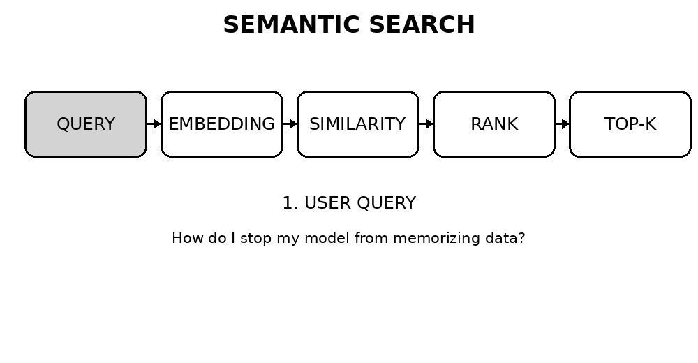

🔎 Semantic Search with Sentence Transformers

  

  <b>Search by meaning, not just by matching words.</b>

📌 What is this project?

This project is a simple implementation of Semantic Search using:

🧠 Sentence Transformers

🔢 Text Embeddings

📐 Cosine Similarity

🗂️ Top-K Retrieval

🐍 Python + NumPy

Instead of looking for exact keywords, the system converts text into numerical embeddings and finds documents that are semantically similar to the user's query.

Example

The user asks:

"How do I stop my model from memorizing the data?"

The knowledge base does not contain that exact question.

However, it contains:

"Overfitting happens when a model memorizes the training data..."

Semantic search recognizes that these two sentences have a similar meaning and retrieves the overfitting document.

🚀 How it works

flowchart LR
    A["👤 User Query"] --> B["🧠 Sentence Transformer"]
    B --> C["🔢 Query Embedding"]

    D["📚 Knowledge Base"] --> E["🧠 Sentence Transformer"]
    E --> F["🔢 Document Embeddings"]

    C --> G["📐 Cosine Similarity"]
    F --> G

    G --> H["📊 Similarity Scores"]
    H --> I["⬇️ Sort Highest → Lowest"]
    I --> J["🎯 Top-K Documents"]

In simple words

User Query
    ↓
Convert query into an embedding
    ↓
Compare with every knowledge-base embedding
    ↓
Calculate cosine similarity
    ↓
Sort results
    ↓
Return the most relevant documents

🧩 Main Components

1. Knowledge Base

A list of documents containing information about machine learning:

knowledge_base = [
    "Linear regression finds the best straight line...",
    "Decision trees make predictions...",
    "Overfitting happens when a model memorizes...",
    ...
]

2. Sentence Transformer

The project uses:

SentenceTransformer("sentence-transformers/all-MiniLM-L6-v2")

It converts sentences into numerical vectors called embeddings.

Conceptually:

"Overfitting means memorizing training data"
                    ↓
              Sentence Transformer
                    ↓
       [0.12, -0.43, 0.87, ...]

The vector represents the semantic information of the sentence.

3. Document Embeddings

Every knowledge-base document is converted into an embedding:

kb_embeddings = model.encode(knowledge_base)

These embeddings are calculated once and then reused during searches.

4. Query Embedding

When the user searches:

query_emb = model.encode(query)

The query is converted into the same embedding space as the knowledge base.

This allows the system to compare the query with the documents.

5. Cosine Similarity

The project calculates how similar two embeddings are:

cosine_similarity(query_emb, doc_emb)

A higher value means the vectors point in a more similar direction.

Typical interpretation:

1.0  → Very similar
0.8  → Highly related
0.5  → Somewhat related
0.0  → Little/no similarity

The exact meaning of a score depends on the model and dataset, so the values should primarily be used for ranking.

🎯 Top-K Retrieval

The search function uses:

semantic_Search(query, top_k=3)

top_k=3 means:

Return the 3 most semantically similar documents.

The results are stored as:

(similarity_score, document_index)

For example:

[
    (0.91, 3),
    (0.84, 9),
    (0.78, 4)
]

This means:

Rank 1 → similarity 0.91 → knowledge_base[3]
Rank 2 → similarity 0.84 → knowledge_base[9]
Rank 3 → similarity 0.78 → knowledge_base[4]

Then:

knowledge_base[idx]

retrieves the actual document using its index.

🔍 Example Search

semantic_Search(
    "how do I stop my model from memorizing the data"
)

The system may retrieve documents related to:

#1  Overfitting
    A model memorizing training data...

#2  Regularization
    A penalty that discourages complex models...

#3  Cross-validation
    A method for estimating model performance...

The important point is that the search works from semantic meaning, not only exact word matches.

🧠 Important Code

Calculate similarity

def cosine_similarity(vec1, vec2):
    vec1, vec2 = np.array(vec1), np.array(vec2)

    return float(np.dot(vec1, vec2)) / (
        np.linalg.norm(vec1) * np.linalg.norm(vec2)
    )

Search the knowledge base

def semantic_Search(query, top_k=3):

    query_emb = model.encode(query)
    result = []

    for i, doc_emb in enumerate(kb_embeddings):

        sim = cosine_similarity(query_emb, doc_emb)

        result.append((sim, i))

    result.sort(reverse=True)

    for rank, (sim, idx) in enumerate(result[:top_k], 1):

        print(f"\n#{rank} [similarity: {sim:.4f}]")
        print(f"{knowledge_base[idx]}")

    return result[:top_k]

🆚 Keyword Search vs Semantic Search

Keyword Search

Semantic Search

Looks for matching words

Looks for related meaning

Exact terms are important

Exact wording is less important

Simple to implement

Uses embeddings

Can miss differently worded queries

Can find differently worded queries

Example: "overfitting"

Example: "why does my model memorize data?"

🏗️ Project Architecture

                 ┌──────────────────────┐
                 │     Knowledge Base    │
                 └──────────┬───────────┘
                            │
                            ▼
                 ┌──────────────────────┐
                 │ Sentence Transformer │
                 └──────────┬───────────┘
                            │
                            ▼
                 ┌──────────────────────┐
                 │ Document Embeddings  │
                 └──────────┬───────────┘
                            │
                            │
User Query ───────► Embedding Model
                            │
                            ▼
                 ┌──────────────────────┐
                 │  Cosine Similarity   │
                 └──────────┬───────────┘
                            ▼
                 ┌──────────────────────┐
                 │    Rank Results      │
                 └──────────┬───────────┘
                            ▼
                 ┌──────────────────────┐
                 │      Top-K Docs      │
                 └──────────────────────┘

📦 Installation

pip install sentence-transformers numpy

Then run the notebook:

Semantic_Search.ipynb

🔗 Connection to RAG

This project is an important building block for Retrieval-Augmented Generation (RAG).

Currently:

Query
 ↓
Semantic Search
 ↓
Relevant Documents

A RAG system adds an LLM:

User Query
     ↓
Semantic Search
     ↓
Relevant Documents
     ↓
LLM + Retrieved Context
     ↓
Generated Answer

So this project focuses specifically on understanding the retrieval part of RAG.

📚 Concepts Learned

Text embeddings

Sentence Transformers

all-MiniLM-L6-v2

Vector representations

Cosine similarity

Semantic similarity

Ranking

Top-K retrieval

Knowledge bases

Foundations of RAG

🛠️ Future Improvements

Possible next steps:

Add an LLM to generate answers from retrieved documents

Build a complete RAG pipeline

Store embeddings in a vector database

Add similarity thresholds

Add document chunking

Create a REST API using Flask/FastAPI

Build a simple web interface

Compare multiple embedding models

👨‍💻 Project

Semantic Search — Embeddings + Cosine Similarity

A beginner-friendly implementation designed to understand how semantic retrieval works before moving into production-level RAG systems.
